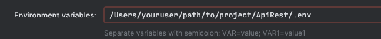

# API REST con Spring Boot y Docker

Esta es una aplicación de ejemplo que demuestra cómo ejecutar una API REST desarrollada con Spring Boot utilizando Docker.

En el archivo application.properties hay dos regex que se pueden configurar.
El primero es para el formato de email y el segundo para la contraseña.

Para los valores iniciales se tomó un regex de ejemplo para el correo y para la contraseña el regex está validando 
mínimo 7 caracteres y que contenga al menos un número.

## Requisitos previos

- Docker
- Maven

## Pasos para ejecutar la aplicación usando docker

1. Clona este repositorio en tu máquina local:
2. Compila el proyecto utilizando Maven: `mvn clean package`
3. Construye la imagen de Docker para la aplicación: `docker build -t api-rest .`
4. Levanta los contenedores Docker usando Docker Compose: `docker-compose up`
5. Realiza una solicitud POST a http://localhost:8080/api/v1/auth/authenticate con el siguiente cuerpo:
    ```javascript
    {
        "username": "admin@test.com",
        "password": "123"
    }
   ```
    Deberías recibir una respuesta como esta:
    ```javascript
    {
        "token": "token_generated"
    }
   ```
6. Llama al endpoint http://localhost:8080/api/v1/user configurando el Bearer Token en el encabezado de la solicitud y usando el token recibido en el paso anterior.
7. Para Destruir los contenedores puedes ejecutar: `docker-compose down -v`
8. Este proyecto tiene configurado swagger, entra a la url http://localhost:8080/swagger-ui.html para acceder a la documentación de los otros endpoints. 

## Pasos para ejecutar la aplicación en local

### Requisitos previos
- Docker
- Maven
- Postgresql (crea una bd con nombre apirest)
- Intellij IDEA

1. Crea el archivo .env usando el ejemplo proporcionado en .env.example
2. Configura IntelliJ para que cargue el archivo .env

3. Puedes proceder a ejecutar el proyecto.